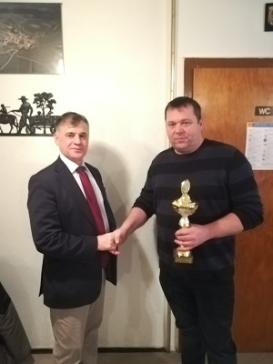

**Jürgen Ferber neuer Vereinsmeister**

Bei der bereits zum 34. Mal traditionell am 05. Januar im Gasthaus Pfefferer  ausgetragenen Schafkopf-Vereinsmeisterschaft des VGF Wittesheim, konnte wiederum ein Spieler aus Liederberg den begehrten Pokal gewinnen. Mit 104 Punkten siegte der Schafkopf-Spezialist Jürgen Ferber und wird somit der Nachfolger vom Vorjahressieger Günther Hasmüller. 
Um den zweiten Platz entstand ein heißer Kampf zwischen den Wittesheimern Patrick Pfefferer und Hans Schneck. Mit nur 2 Punkten Vorsprung konnte Hans Schneck
(83 Punkte) den drittplatzierten Patrick Pfefferer (81 Punkte) auf Distanz halten. 

Nachdem die ersten 6 Plätze Geldpreise erhielten, konnte dank zahlreicher Sachspenden an alle weiteren Teilnehmern ein kleines Präsent überreicht werden.
Den Sponsoren sei hier nochmals ein recht herzlicher Dank ausgesprochen.
Euer VGF Wittesheim

Ergebnisliste: **[Vereinsmeisterschaft 2019](Ergebnissliste%20Schafkopfvereinsmeisterschaft%202019.pdf)**