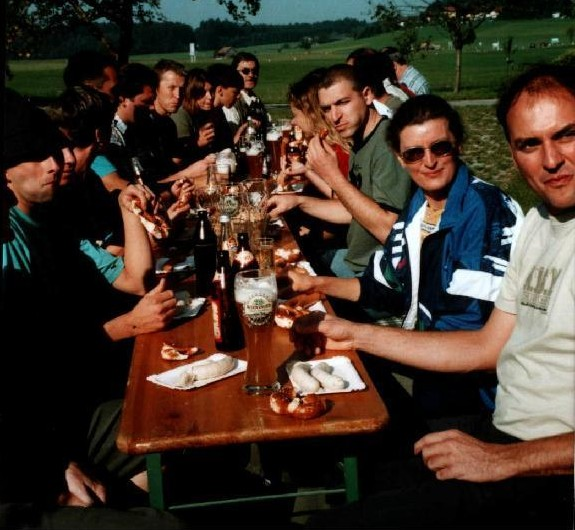
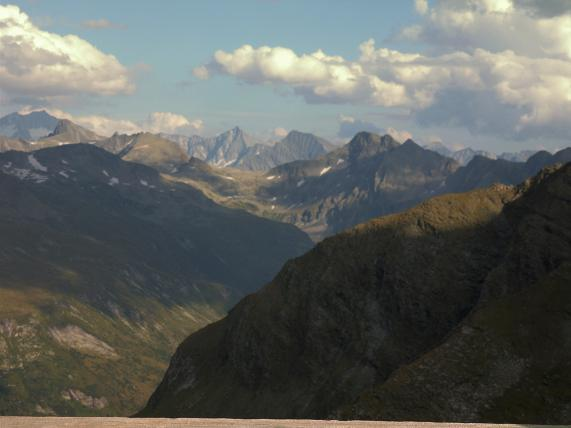

Am Freitag früh um 5.00 Uhr war es endlich soweit, das Highlight des Jahres begann am Stachus. Pünktlich machten wir uns auf den Weg zum Niedersachsenhaus in ÖSTERREICH. ein zünftiges Weisswurstfrühstück bei Romana und Martin Pfeifer um 8.30 Uhr kam gerade richtig damit die restliche Strecke nach Sportgastein in Angriff genommen werden konnte. Um halb eins ging’s dann endlich bergauf. Bei super Fernsicht und idealen Wetterbedingungen konnte noch der 2850m hohe Gipfel gestürmt werden. Das Abendessen wurde durch zünftige Zittermusik, sowie durch eine Teufelsgeige und einer Quetschn zum wahren Genuß. So wünschte uns der Wirt um 23.00 Uhr mit einer Runde Schnaps auf Kosten der Hütte eine gute Nacht. In dem geräumigen Matratzenlager fanden wir die richtige Erholung für den bevorstehenden zweiten Tag. Da Abschied nehmen immer schwer fällt, hat unser Hüttenwirt schnell noch ein paar Abschiedstropfen auf seine Kosten spendiert. Ein kleines Schnäpschen gleich nach dem Frühstück wirkt doch oft kleine Wunder. Alle waren gut drauf und schon gings hinauf, nauf aufn Berg.

Ein 5 stündiger Abstieg an Wasserfällen, wunderschöner Bergseen, Murmeltieren, guten Wanderwegen, Höhlendurchgängen und bilderbuchartigen Fernsichten beendeten unseren Ausflug in die Berge. Da der 2 tägige Ausflug  durch die Familie Pfeifer und von unserem Andy perfekt organisiert wurde , waren sich alle einig, dass nächstes Jahr wieder ein neuer Berg vom VGF bezwungen wird.

Einen Freitag Morgen beginnt man am Besten mit einem Weißwurstfrühstück.
Im Garten der Pfeifers in Österreich schmeckt es gleich zweimal gut, da es auch noch Gutmann Weizen gibt.

	
Ausblick von der Terrasse des Niedersachsenhauses.