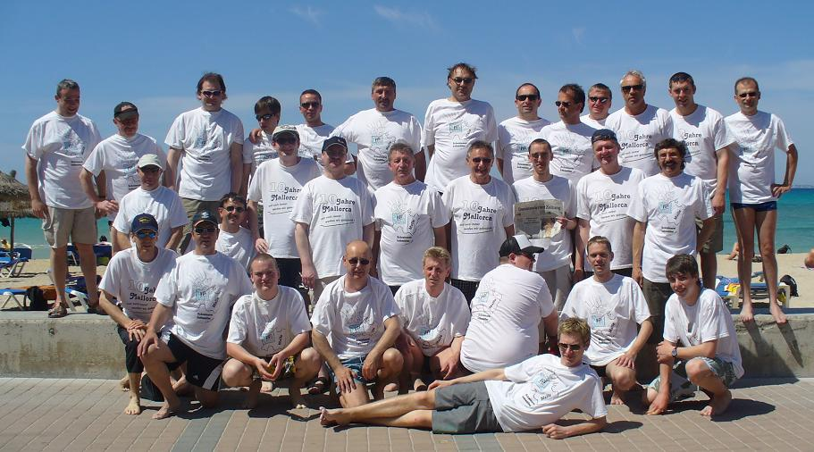

**Los chicos del VGF estan en casa otra vez**
*(Die VGF´ler sind wieder zuhause)*

Pünktlich um 22:40 Uhr landete am 10.05.08 der Airbus 320 mit allen 35 Teilnehmern des VGF Vatertagstrip nach Mallorca in München. Eine harte, aber wunderschöne Trainings-woche der „Ballermänner“ ging damit leider (für manche viel zu früh) zu Ende.

===

Doch zunächst zurück zum Start des Ausflugs zur größten Baleareninsel. Überpünktlich und voller Tatendrang verließen wir unsere Heimat um im wolkenlosen Flughafen von Palma zu landen, wo wir bereits sehnsüchtig erwartet wurden. Schnell die Koffer im Zimmer abgestellt, ging man auf die nächtliche Pirsch um das Jagdrevier zu erkunden. Dabei konnte ein Jeder schon einmal seine persönliche Duftmarke setzen.

	
Die 10 Jahre Mallorca Jubiläums T-Shirts (mit dem Schriftzug: „10 Jahre Mallorca und noch immer werden wir gebraucht“), die von der Schreinerei Klaus Lohmüller aus Daiting gesponsert wurden (danke Klaus), konnten bei strahlend blauen Himmel am Strand von El`Arenal mit stolzer Brust präsentiert werden. Sangria, San Miguel, Sonnencreme und schöne Frauen standen in den nächsten Tagen auf der Tagesordnung bzw. auf der Speisekarte. Ein vom Ludwig Hirschbeck (er reiste extra für uns schon 3 Tage vorher an) perfekt geplantes und durchgeführtes Ausflugprogramm sorgte für Kurzweil, Unterhaltung und viele interessante Informationen. Dabei lernten wir bei einer geführten Fahrradtour nach Palma und einer kombinierten Inselrundfahrt mit Bus, Schiff und historischer Eisenbahn die schöne mallorquinische Landschaft, sowie viele Sehenswürdigkeiten kennen.

	
Weiter durften bei den Ausflugszielen neben der Stadt Palma, der Fischerhafen von Porta Andratx mit den Luxusjachten, die Tropfsteinhöhlen von Portocristo, sowie einer der schönsten Strandabschnitte Mallorcas, Cala Agulla, mit schneeweißen Sand und türkisblauen Meer, nicht fehlen.

Der schönste Tag während des Vatertag-Trips wurde für die VGF-Strandparty am berühmten Ballermann 6 genutzt. Lustige Strandspiele, kühles Bier, ein ruhiges Meer und viele heiße und vor allem hübsche Frauen (in unserer VIP-Lounge) gaben der Party den richtigen Rahmen und ließen den Tag zu einem weiteren, unvergessenen Highlight werden. Zudem statteten uns auch die TV-Sender RTL und Pro Sieben einen Besuch ab.

Gerade rechtzeitig zum Ende unseres Ausfluges  kam der kühle Regen über die aufgeheizte Insel. Die sonnenbrandgefährdete Haut und die von San Miguel strapazierten Mägen, konnten eine Ruhepause einlegen. Leider fiel dem schlechten Wetter die zum Abschluss geplante „Segeltörn“ mit einem Katamaran zum Opfer. Doch das tägliche Bad im Pool unseres Hotels Oleander fand nach dem Motto: „Nur die HARTEN kommen in den Garten“ trotzdem statt.

Die 10-jährige VGF Epoche „Vatertagstrip nach Mallorca“ fand mit dieser 8-tägigen Fahrt ein vorzügliches Ende und geht wohl als eine der besten Veranstaltungen in die Vereins-geschichte ein.

Die VGF Vorstandschaft, übrigens mit 6 von 8 männlichen Vorstandschaftsmitgliedern beim Trip vertreten, bedankte sich bei Ludwig Hirschbeck, der die Reiseleitung und Organisation in all den Jahren durchführte und sein wohl auch persönliches Meisterstück mit der völlig gelungenen Jubiläumsveranstaltung gemacht hat.

**Die VGF Vorstandschaft bzw. 35 Strahlemänner**