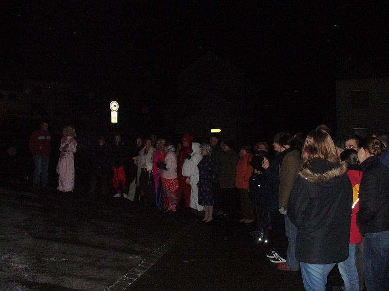

Die Hütte war total überfüllt. Die Stimmung beim Kehraus fast nicht menr zu toppen. Gaudi pur durch zahlreiche Maskerle und Einlagen.

===

Da ging es der Hexe noch gut. Nach der Lesung und den Fürbitten gab es einen letzten Trunk.

	
Zahlreiche Maskerle verfolgten das Ende des Faschings. Manche weinten sogar ein wenig.

Aus und vorbei ist es nun mit dem Fasching. Pünktlich um 0:00 Uhr ging die Hexe in Flammen auf. Das Gejammer war groß, aber am 11.11.06 ist es ja wieder soweit.