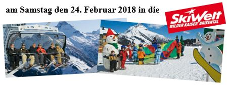

Download Info: **[VGF Tagesskifahrt 2018](VGF%20Tagesskifahrt%202018.pdf)**

===

**Reiseleistungen:**
- Busfahrt in einem Reisebus der Firma Lotter
- 1-Tagesskipass
- 1 Apres-Ski Getränk auf der Heimfahrt
				
**Preis:**			
Erwachsene					ca. 60 €
Jugendliche (Jahrgang 1999-2001)	ca. 50 €
Kinder (Jahrgang 2002-2011)		ca. 39 €
Busfahrt						ca. 16 €
Skipass für Kinder ab Jahrgang 2012 frei

**Abfahrt:**			
Stachus Wittesheim				4.30 Uhr
Monheim beim Gottfried			4.35 Uhr

**Rückfahrt:**   Abfahrt am Skigebiet 18.00 Uhr
**Rückankunft:** Wittesheim			ca.	21.30 Uhr
				
**Anmeldungen ab sofort bei:**
Hans Glaß
Bitte bei der Anmeldung gleich die Wienerle oder Weißwürste für die Busfahrt bestellen!!
