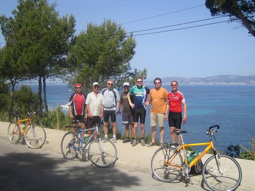
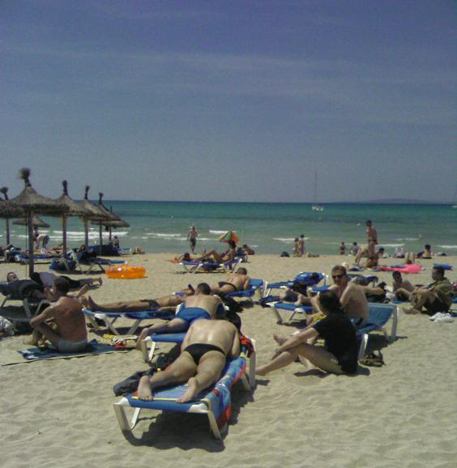

**13. - 20. Mai 2006**

Busfahrerin Andrea traute ihren Augen nicht, als sie um 2:00 Uhr Nachts den Wittesheimer Stachus ansteuerte: „Wollen die alle mit?“ war ihr entgeisterter Kommentar als sie ca. 50 Personen ausmachte. „Nein, der Großteil ist das Verabschiedungskomitee. Schließlich heißt es nun für eine Woche Abschied von unseren LIEBEN zu nehmen“, erwiderte ich. Auf Grund der großen Anteilnahme unserer Freunde und besseren Hälften drehten wir spontan noch eine Dorfrunde, was die Zurückgebliebenen mit einer „La-Ola-Welle“ zu quittieren wussten. Bei einem letzten Blick aus dem Fenster sah ich vereinzelte Tränen. Ich wendete mich ab. Im Inneren des Busses sah ich sie dann auch. Allerdings hatten diese einen anderen Namen und hießen Freudentränen.

Pünktlich und pannenfrei erreichten wir den Münchner Flughafen und hoben um 6:00 Uhr mit dem Airbus 320 ab. Nach zwei Stunden und zehn Minuten landeten wir sanft auf der Rollbahn von „Palma de Mallorca“ und wurden sogleich von den Einheimischen auf das freundlichste begrüßt. Die Sonneninsel hatte uns wieder!!! Wir waren dem grauen Alltag endgültig entflohen und konnten nun bei strahlend blauem Himmel und täglichen Temperaturen um die 30 Grad Celsius unseren Trip endlich genießen.

Um vor allem unseren „Newcomern“ die Insel etwas näher zu bringen (schließlich besteht diese nicht nur aus Strand), standen diverse Ausflüge auf dem Programm.

 

* Die Kombi-Rundfahrt (mit Bus, Schiff und Bahn) als Entdeckungsreise. Sie führte mit dem Bus durch das Landesinnere vorbei an riesigen Weinbaugebieten zur Industrie-stadt Inca (Leder- und Schuhwaren), ehe man den größten Wallfahrtsort Mallorcas das Kloster Lluc erreicht hatte. Benannt wurde die imposante Klosteranlage nach dem maurischen Hirtenjungen Lluc (Lukas), der im Gebüsch eine dunkelfarbige Madonnenfigur fand, die er zum Pfarrer der Kapelle Sant Pere brachte. Doch merk-würdigerweise verschwand die Statue immer wieder an ihrem ursprünglichen Fundort. Dies deutete man als „Wink Gottes“ und so erbaute man im Jahr 1622 an der Fundstelle eine Kapelle, aus der sich im Laufe der Jahrhunderte ein gewaltiger und wunderschöner Klosterkomplex entwickelte.
* Fortgesetzt wurde die Reise durch die faszinierenden Schluchten von La Calobra und die atemberaubende Bergwelt um den höchsten Berg der Insel dem Puig Major. Mit dem Schiff wurde anschließend Kurs Richtung Port de S`oller aufgenommen. Ein malerischer Ort inmitten duftender Zitronen- und Olivenhaine. Mit der historischen Holzeisenbahn (von den Mallorquinern liebevoll „Roter Blitz“ genannt) ging es dann zurück nach Palma.
* Mit dem Rad die Inselschönheiten erkunden und zugleich etwas für die Fitness tun. Auch diese Tagestour hinterließ bei den Teilnehmern einen bleibenden Eindruck. Die Fahrt führte entlang dem herrlich ausgebauten Radweg nach Palma, vorbei an der Kathedrale La Seu (ein Meisterwerk der gotischen Baukunst und das Wahrzeichen Palmas) über die Hafenpromenade - dem Tummelplatz von Luxusjachten und Segelschiffen - zum historischen Hafen „Porto Pi“. Immer wieder traumhafte Aus-sichten genossen wir auf der weiteren Strecke die uns Richtung Cala Major führte, ehe wir nach einer kleinen „Stärkung“ die Rückfahrt antraten.

Ein herrliches Erlebnis war auch die Segeltörn auf einem Katamaran (Doppelrumpf-Boot) über die tiefblaue See zu den schönsten Buchten der Süd-West-Küste Mallorcas. Dabei bot sich die Gelegenheit im türkisfarbenen, kristallklaren Meer zu schwimmen und zu schnorcheln. Ein leckeres Essen an Bord (Grillspezialitäten mit Salaten und obligatorischer Sangria) rundeten bei strahlendem Sonnenschein den wunderschönen Tag ab.
* Zumindest für 15 VGF`ler war dem so. Für den 16. leider nicht. Er hatte im Bus (unbemerkt von unserer Reisegruppe) ein „Nickerchen“ gemacht und folglich - im wahrsten Sinne des Wortes - den Ausstieg verpasst. Als er wieder erwachte, fuhr der Bus auf der Autobahn Richtung Alcudia. Er wandte sich um und sah keine ihm vertrauten Gesichter mehr. Auf Nachfrage wurde ihm erklärt, das er sich jetzt auf einer Schulklassenfahrt zu einer Bergwerksbesichtigung befand.
* Damit sich ein derartiger Vorfall nicht nochmals ereignet, hat die Reiseleitung des VGF Wittesheim kurzerhand beschlossen, ab dem nächstem Jahr zusätzlich einen „Bus-Entleerer“ zu organisieren. Dennoch (oder vielleicht auch deshalb) wird der Vatertagstrip 2006 auch für Kandidat Nr. 16 wohl in unvergessener Erinnerung bleiben.

*Einer der vielen traumhaften Ausblicke anlässlich unserer Tages-Radtour*

*Strandleben pur - Mittendrin statt nur dabei*

**Es grüßen bis zum nächstem Jahr................
            .......................der REISELEITER und seine 20 Untertanen!!!**