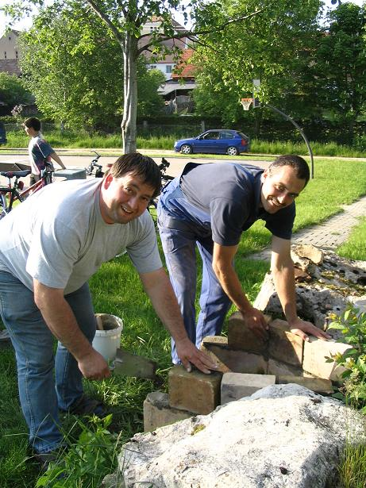
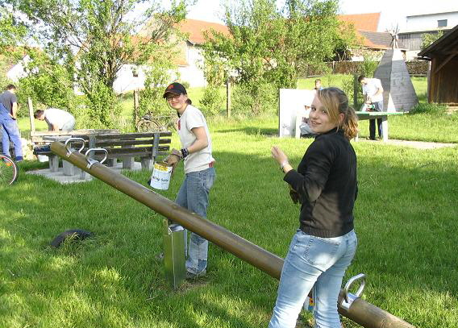

**Auch heuer wurde unser Wittesheimer Spielplatz wieder hergerichtet.**

So kamen zahlreiche Helfer (11 Männer und 2 Mädels) damit die Spielgeräte wieder in TOP FORM gebracht wurden.

===

- Unser Holzzelt bekam eine Luke und Schlitze zum Spitzeln.

- Unsere Torwand bekam einen neuen Platz und neue Füsse.

- Unser Abfalleimer und unsere Leiter der Rutsche wurden “grasfrei” gemacht und bekamen neue Betonfüsse, so kann unsere Jugendgruppe , die Wölfe , den Rasen des Spielplatzes besser mähen. Übrigends ergeht hier recht herzlicher Dank an die Wölfe für die Übernahme der Rasenmäherdienste. Vielen Dank und möge der Rasenmäher mit Euch sein.

- die Asphaltfläche wurde von Unkraut befreit.

- Alle Holzteile wurden neu gestrichen. (Schwebebalken, Schaukel, Bank, Sitzgelegenheit an der Asphaltfläche,    Wippe, Kreisel, Schaukelpferd)

- Die Tischtennisplatte wurde neu ausgerichtet und  eine Ablage für Schläger und Bälle wurde angebracht.

- Unser Grill wurde wiederhergestellt und mit Beton verstärkt.

- an unserer Holzhütte wurde eine neue Dachrinne angebracht.

- Unser Holzbank bekam eine neue Lehne

Als kleine Belohnung für die 3 stündige Aktion lud der VGF Wittesheim zu ein paar Halben Bier und zu einer Pizza ein.
Bleibt zu hoffen, dass nächstes Jahr wieder einige fleissige Helfer kommen und wieder zupacken wenn es heißt: Der VGF Wittesheim räumt auf und richtet den Kinderspielplatz.

**Recht herzlichen Dank sagt der VGF Wittesheim an alle freiwilligen Helfer, die sich an diesem Abend Zeit genommen haben und  mitgeholfen haben !!**

 
	
Andy und Oliver sind genau die richtigen Männer für unsere Sportgeräte. ( Bild oben)

Gerhard und Xaver die Fachmänner für Bau machen den Grill nun zerstörungssicher und verwenden auch Beton mit dem Mischungsverhältnis 1:1 (Zementanteil=Sandanteil) (Bild rechts)

Ein Schreiner (Michael) und ein Konstrukteur (Erich) sind schon notwendig wenn man ein elegantes Holzzelt umbauen möchte. 

	
Unsere Mädels wollten mal wieder neue Klamotten von Ihren Eltern. Schnell den Farbpinsel geschnappt und fleissig Holz und Hose angestrichen. Eine zarte Frauenhand hat halt das richtige Gefühl für einen schönen und gleichmässigen Anstrich.

Im Hintergrund wird unsere Tischtennisplatte von 2 Meistern (Anton und Markus) umgebaut. Ihr Metallberuf und bärenstarke Muskeln waren hier notwendig die Ablage für Tischtennisschläger zu montieren. 

Arbeiten macht durstig! Gut dass man 2 Hände hat, eine zum Aufstützen die andere zum Schlucken.
Prost, das Radler habt ihr Euch echt verdient!!
