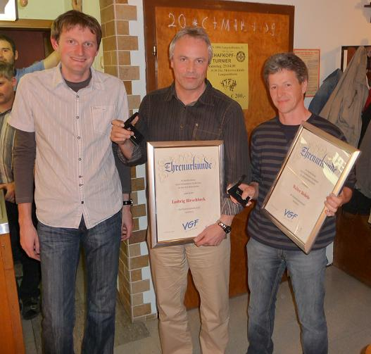

# Neuwahlen bescheren dem VGF Wittesheim eine neue Führungsriege

Auf ein erneut sehr erfolgreiches und abwechlungsreiches Vereinsjahr konnte bei der diesjährigen Jahreshauptversammlung des „Vereins zur Gestaltung der Freizeit“ (VGF) Wittesheim der 1. Vorstand Lothar Lechner zurückblicken. Unter den 91 anwesenden Mitgliedern im Gasthaus Pfefferer konnte er besonders den 1. Bürgermeister der Stadt Monheim Anton Ferber, den 2. Bürgermeister Günther Pfefferer sowie den Vorstand der Freiwilligen Feuerwehr Wittesheim Christian Sandner begrüßen. Nach dem Totengedenken und dem gemeinsamen Essen verlas Schriftführer Armin Luderschmid das Protokoll der letzten Jahreshauptversammlung.

In seinem Jahresrückblick ging Vorsitzender Lechner nochmals auf das Highlight des abgelaufenen Vereinsjahres, nämlich den Jubliäums-Vatertagstrip (zehnmal in Folge!!) nach Mallorca mit sage und schreibe 35 „Vätern bzw. Männern“ ein. Dies sei für alle Teilnehmer ein unvergessliches Erlebnis gewesen. Dass der Verein gut im Feiern ist, bewies er auch beim abgehaltenen Oktoberfest, das mittlerweile auch viele auswärtige Gäste anlockt. Auch die Theateraufführung fand wieder großen Anklang und so waren sämtliche Tickets für die Veranstaltungen im Nu vergriffen. Ebenso erfreut zeigte sich Lechner über die gute Resonanz beim Bergwandern, lobte die Aktivitäten der Läufergruppe und deren Engagement beim zum 25. Mal ausgetragenen Kirchweihlauf. Das Vereins-Motto: „sportlich, aktiv, gesellig“ wurde daher auch in diesem Jahr wieder eindrucksvoll unter Beweis gestellt. Besonders bedankte sich der Vorsitzende anschließend bei Christina Grob für das Leiten der Aerobicgruppe, bei Thomas Luderschmid für das Abhalten des Herrentrainings, bei der Leiterin der Damengymnastik Brigitte Glaß sowie bei Otto Eder (der Mann für besondere Fälle) jeweils mit einem kleinen Präsent.

Im Anschluss daran hatte Lechner alle Hände voll zu tun, standen doch die Ehrungen zur 25-jährigen Mitgliedschaft an. Den „treuen“ insgesamt 34 Mitgliedern wurde dabei eine Ehrenurkunde ausgehändigt. Im Einzelnen wurden geehrt:

Binder Josef, Brechenmacher Maria, Brechenmacher Rita, Burgetsmeier Maria, Dürr Elvira, Dürr Erich, Eder Anneliese, Eder Helene, Eder Jürgen, Fitzek Erna, Glaß Hans, Glaß Maria, Glaß Petra, Hahn Marianne, Knoll Juliana, Köttel Franz,  Lechner Hildegard, Lechner Lothar, Luderschmid Klara, Meyer Norbert, Meyr Johann, Rosenwirth Andreas, Rosskopf Anni, Sandner Johann, Sandner Josefine, Sandner Lorenz, Sandner Manfred, Schaller Rosa, Scharnagl Rita, Schmid Maria, Siebert Klara, Strommer Elisabeth, Strommer Ignatz, Strommer Wendelin.

Der Mann der Finanzen Rainer Ferber erläuterte in seinem Bericht die Einnahmen- und Ausgabenseite des abgelaufenen Vereinsjahres. Die lang-jährigen Kassenprüfer Anton Grob und Robert Mittel erteilten dem Kassier Entlastung, auch wenn im abgelaufenem Jahr ROTE Zahlen geschrieben wurden.

Die turnusgemäß erforderlichen Neuwahlen unter der Leitung von Wahlvorstand Günther Pfefferer brachten folgendes Ergebnis:

1. Vorstand Rainer Ferber, 2. Vorstand Andreas Eder, Kassier Melanie Roßkopf, Schriftführer Thomas Luderschmid. Als Beisitzer wurden Hans Glaß, Andreas Oberbauer, Stefan Oberbauer, Manuel Roßkopf, Christina Grob, Julia Sandner und Melanie Dürr von den Mitgliedern gewählt.

Anschließend gab der neu gewählte Vorstand Rainer Ferber einen kurzen Einblick in die Planung des anstehenden Stadtfestes in Monheim, welches der VGF wieder mit verschiedenen Aktivitäten bereichern wird. Im Anschluss bedankte sich Ferber bei den ausscheidenden Vorstandschaftsmitgliedern Lothar Lechner, Armin Luderschmid und Nicole Rosenwirth für die jahrelange Unterstützung mit einem Präsent.

Eine ganz besondere Ehre wurde den beiden ebenfalls ausscheidenden Vorstandschaftsmitgliedern Ludwig Hirschbeck und Walter Rebele zuteil. Für ihre langjährigen Verdienste um den VGF (seit Gründung des Vereins vor 27 Jahren ununterbrochen in der Vorstandschaft tätig) wurden sie unter kräftigem  Applaus der großen VGF-Familie zu Ehrenmitgliedern ernannt und mit einer Ehrennadel und Ehrenurkunde ausgezeichnet.

Bürgermeister Anton Ferber informierte in seinem Grußwort die Mitglieder über den aktuellen Stand hinsichtlich der geplanten Vereinshalle und lobte den  vorbildlichen Zusammenhalt. Gleichzeitig wünschte er der neuen Vorstand-schaft - zum Wohle des Vereins - in jeder Hinsicht alles Gute.

Nach Abhandlung der vorgetragenen Wünsche und Anträge beendete der neue VGF-Chef Rainer Ferber die wie immer harmonisch verlaufene Versammlung.

“For the last time”

 *Armin Luderschmid (Schriftführer)*
 
 
 **Der neue 1. Vorstand Ferber Rainer übergibt ein Abschiedsgeschenk an den Ex Chef Lechner Lothar.**
 
 
 **Über die Ehrenmitgliedschaft des VGF Wittesheim freuen sich Hirschbeck Ludwig (mitte) und Rebele Walter (rechts).**