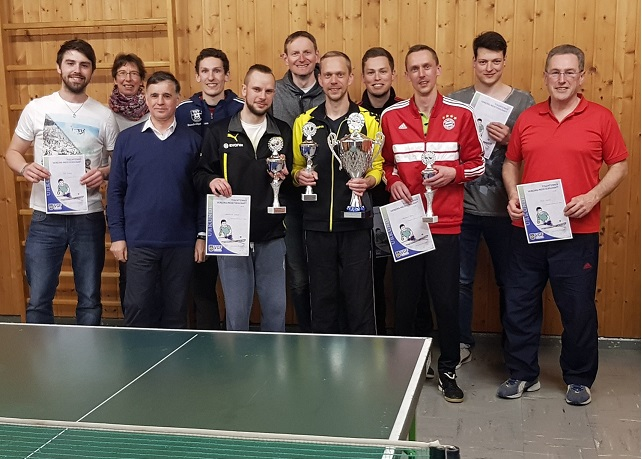

**Triple für die Luderschmid‘s**

**Thomas Luderschmid verteidigt seinen Titel bei der VGF-Tischtennis-
Vereinsmeisterschaft gegen seine Brüder Michael und Armin.**

Traditionell fand die Tischtennis-Vereinsmeisterschaft des VGF-Wittesheim wieder am
Karfreitag, den 30.03.2018 in Wittesheim statt. Heuer waren es 14 Teilnehmer, die in einer
Endrunde - welche pünktlich um 10:00 Uhr begann - den neuen Vereinsmeister ermittelten.

===
Vorjahreszweiter und VGF-Chef Andreas Eder musste dieses Jahr aufgrund einer Verletzung
aussetzen, fungierte aber als Oberschiedsrichter. Die Auslosung hatte es wieder einmal in
sich. Vorjahressieger Thomas Luderschmid musste gleich im ersten Spiel gegen seinen
Bruder Armin ran. Er entschied dieses Duell klar mit 11:4, 11:3 und 11:6 für sich.
Anschließend zeigte sich Bruder Michael weniger „charmant“ und schickte die einzige Dame
des Turniers Anja Schneck mit 11:1, 11:0 und 11:4 in die Trostrunde. In einem zweiten
Bruderduell siegte Armin Meyer gegen Simon in einem Fünfsatz-Krimi mit 11:2, 8:11, 11:6,
10:12 und 11:7. Deren Vater Nobert konnte aufgrund eines Freiloses genauso wie Fabian
Pfefferer kampflos in die nächste Runde vorrücken. Neu-Mitglied Dominik Weiß verlor in
einem hart umkämpften Match gegen Thomas Glaß mit 7:11, 14:12, 11:3, 8:11 und 5:11. Der
windige Hans Glaß holte zwar alles aus sich heraus, unterlag jedoch Dominik Mittel mit 8:11,
9:11, 11:7 und 10:12. Den letzten Platz in Runde 2 sicherte sich Andreas Herb mit einem Sieg
gegen Andreas Wild mit 13:11, 9:11, 11:6 und 11:5.
Derweil setzten die Favoriten ihre Siegesserie fort. Thomas Luderschmid gewann gegen den
„kalten“ Fabian Pfefferer problemlos mit 11:5, 11:4 und 11:1 und Armin Meyer schlug
Thomas Glaß in drei Sätzen mit 12:10, 11:7 und 11.6. Andreas Herb musste gegen Norbert
Meyer antreten und konnte dieses Duell mit 11:8, 11:8, 3:11 und 11:6 für sich entscheiden.
Michael Luderschmid fertigte Dominik Mittel mit 11:5, 11:6 und 11:4 ab und kam ebenfalls
in Runde 3. Um den Einzug in das Finale der Hauptrunde musste Thomas Luderschmid gegen
Armin Meyer an die Platte. Hier setzte sich Thomas klar mit 11:4, 11:3 und 11:3 durch. Sein
Bruder Michael Luderschmid schickte humorlos Andreas Herb mit 11:1, 11:4 und 11:5 in die
Trostrunde. Somit standen sich nun die Brüder Thomas und Michael Luderschmid gegenüber.
Hier fand der kleine Bruder Michael von Beginn an in sein Spiel, beschäftigte Thomas und
entschied Satz eins knapp mit 15:13 für sich. Auch Satz zwei ging mit 11:5 an Michael.
Thomas haderte mit seinem offensiven Spiel und versuchte die drohende Niederlage noch
abzuwenden. Doch alle Bemühungen halfen nichts. Er verlor auch den dritten Satz mit 11:8
und Michael Luderschmid stand als erster Finalteilnehmer fest.
In der Trostrunde hatte es Simon Meyer mit Dominik Weiß zu tun. Nach sehenswerten
Ballwechseln entschied Simon das Spiel mit 11:4, 11:8 und 11:8 für sich. Anja Schneck traf
auf Hans Glaß. Anja erwischte ihn anscheinend auf dem falschen Fuß, denn ehe Hans sich
versah, schickte ihn Anja mit 11:9, 11:7 und 11:8 unter die Dusche. In Runde 2 der
Trostrunde musste Armin Luderschmid gegen Thomas Glaß antreten. Armin ließ ihm keine
Chance und schickte Thomas mit 11:1, 11:5 und 11:5 seinem Vater Hans hinterher. Simon
Meyer gewann gegen Fabian Pfefferer in einem spannenden Spiel mit 11:4, 11:9, 11:13 und
11:7. In dieser Runde war nun leider auch Schluss für Anja Schneck. Sie verlor gegen Norbert
Meyer mit 11:5, 11:6 und 11:4 und trat den Nachhauseweg an. Runde 3 stand nun an. Armin
Luderschmid hatte sich inzwischen warm gespielt und machte mit Simon Meyer durch einen
3-Satz-Erfolg mit 11:7, 11:9 und 11:4 kurzen Prozess. Norbert Meyer stand Dominik Mittel
an der Platte gegenüber. Der „Oldie“ Norbert konnte den Attacken von Dominik standhalten
und behielt am Ende mit 10:12, 11:8, 11:3 und 11:6 die Oberhand. Armin Luderschmid setzte
seine Siegesserie fort und räumte mit 9:11, 11:7, 11:8 und 11:5 Andreas Herb aus dem Weg.
Stadtrat Norbert Meyer hatte gegen seinen Sohn Armin keine Chance und verlor klar mit
1:11, 8:11 und 5:11. Das Duell der „Armins“ entschied der Routinier Luderschmid mit 11:9,
11:3 und 11:5, verwies Meyer auf Rang vier und wartete auf seinen nächsten Gegner.
Es sollte wieder - wie schon zum Auftaktmatch - sein Bruder Thomas sein. Thomas hatte die
Niederlage gegen Michael inzwischen gut verdaut und die beiden zeigten spannende
Ballwechsel. Offensive von Thomas gegen Defensive von Armin prägten das Spiel.
Schlussendlich setzte sich aber Thomas durch und gewann mit 11:8, 11:9, 8:11 und 11:7.
Armin Luderschmid belegte somit Platz drei.
Die inzwischen gut gefüllte Wittesheimer Schul-Sporthalle freute sich in der Abendsession
auf das große Finale bzw. das erneute Bruderduell Michael gegen Thomas. In der Hauptrunde
hatte Thomas keine Chance gegen das sichere Spiel von Michael. Doch spätestens nach dem
Match gegen seinen Bruder Armin war Thomas warmgelaufen und so kam auch seine
Sicherheit zurück. So ging der erste Satz mit 11:7 direkt an Thomas. Im zweiten Satz lief es
ebenfalls nicht gut für Michael und somit gab er auch diesen mit 6:11 ab. Seine sichere und
konzentrierte Spielweise half ihm auch nicht in Satz drei gegen die offensiven Angriffsschläge
von Thomas und so verlor er diesen ebenfalls mit 6:11. Mit dem Rücken zur Wand
und mit dem Wissen, dass Satz vier bereits die Entscheidung bringen konnte, mischte Michael
zu seinen sicheren Defensivschlägen nun auch platzierte Schmetterbälle. Thomas konnte
diesem Druck jedoch standhalten und hatte stets die passenden Return-Schläge parat. So
entschied er schließlich auch Satz vier mit 12:10 für sich und verteidigte souverän seinen
Vereinsmeistertitel vom Vorjahr.
Die weiteren Platzierungen: 5. Andreas Herb, 6. Norbert Meyer, 7. Simon Meyer und 8.
Dominik Mittel.
Die Siegerehrung nahm Bürgermeister Günther Pfefferer und Stadträtin Gabi Sander vor,
wobei sie jeden Spieler Siegerpokale und Urkunden überreichten. Den von der Sparkasse
Monheim gestifteten Wanderpokal konnte Thomas wieder mit nach Hause nehmen. Nicht
jedoch, bevor daraus der von Herrn Lothar Lechner spendierte „Gewinnersekt“ getrunken
wurde.
Thomas Luderschmid
Sparte Herrentraining
